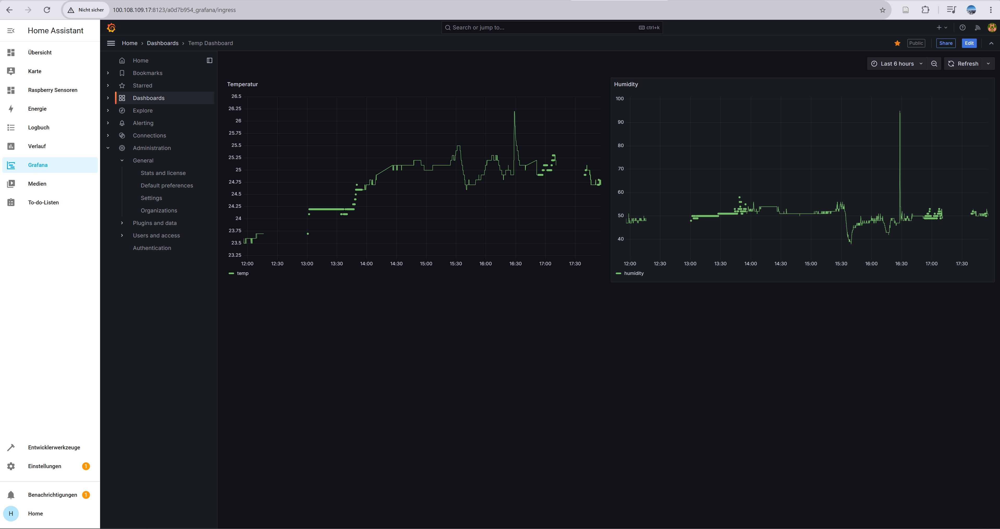

# IDB
## Microcontroller
Ich verwende den Adafruit-Microcontroller mit einem Temperatur- und Luftfeuchtigkeitssensor.
Dieser misst alle 5 Sekunden die Temperatur und Luftfeuchtigkeit und sendet diese an den Raspberry Pi.
Dazu verwende ich das Bluetooth Low Energy Protokoll.
Wenn die Connection zum Raspberry Pi verloren geht, leuchet eine LED auf dem Microcontroller auf.

## Raspberry Pi
Der Raspberry Pi 3b empfängt die Daten des Microcontrollers und speichert diese lokal in einen Zwischenspeicher.
Danach werden die Daten in eine Postgres-Datenbank geschrieben.
Der Raspberry Pi ist über WLAN mit dem Internet verbunden.
Das Python-Programm, das auf dem Raspberry Pi läuft, wird mit dem Programm `supervisord' gestartet und überwacht.

## Postgres Datenbank
Die Postgres-Datenbank läuft auf einem Synology-NAS. Darauf ist Docker installiert und in einem Container läuft diese Postgres-Datenbank.

## Analyse
Die erste Analyse der Daten erfolgt zuerst im Jupyter-Notebook `analytics/analytics.ipynb`.
Die Echtzeitanalyse erfolgt auf der Oberfläche `grafana` welche auf einer `HomeAssistant`-Oberfläche eingebettet ist.
Der HomeAssistant läuft ebenfalls auf dem Synology-NAS und ist über das Internet erreichbar.

## Kommunikation zwischen den Geräten
Ich habe alle Geräte ausser den Microcontroller in einem TailScale-Netzwerk eingebunden.

Sensor -> Microcontroller -> Raspberry Pi -> Postgres-Datenbank -> Grafana
